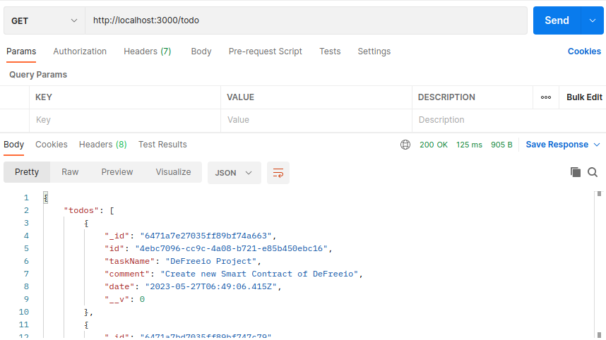

# Todo App

## Introduction

The Todo App is a simple application that allows users to create new todo tasks with comments and displays them in a user-friendly interface. This application has been developed using the MERN stack

### Prerequisites

* [nodejs](https://nodejs.org/en/download/) for install require package with npm
* [MongoDB](https://www.mongodb.com/) for todo store in database

### Technology 

- [ExpressJs](https://expressjs.com/) Node.js web application framework
- [mongoose](https://mongoosejs.com/) elegant mongodb object modeling for node.js

### How to use

Clone GitHub Repository on your PC

```bash
git clone https://github.com/nayanrdeveloper/todo_list
```

Start your local mongoDB service

```bash
cd backend
```

```bash
npm install
```

```bash
node app
```

Now you can check todo app api in postman or other tools.

### Api

```bash
# Get all Todos
GET todo/

# Create new Todo
POST todo/
```
### Screenshots

Get all todo API



Create new todo API


