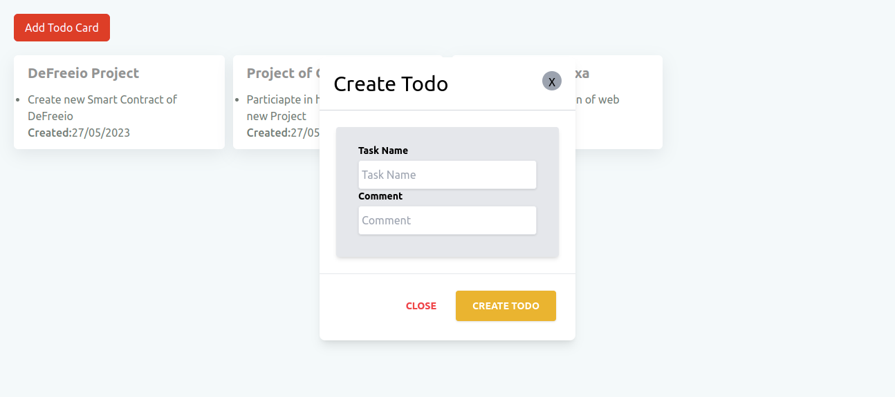

# Todo App

## Introduction

The Todo App is a simple application that allows users to create new todo tasks with comments and displays them in a user-friendly interface. This application has been developed using the MERN stack

### Prerequisites

* [nodejs](https://nodejs.org/en/download/) for install require package with npm

### Technology

- [ReactJs](https://react.dev/) The library for web and native user interfaces

### How to use

Clone GitHub Repository on your PC

If you have not clone this repo
```bash
git clone https://github.com/nayanrdeveloper/todo_list
```

```bash
cd fronted
```

```bash
npm install
```

```bash
npm run dev
```

Open your Project in browser (http://localhost:5173/)

### Screenshots

Home (All Todo Card)


Create New Todo

